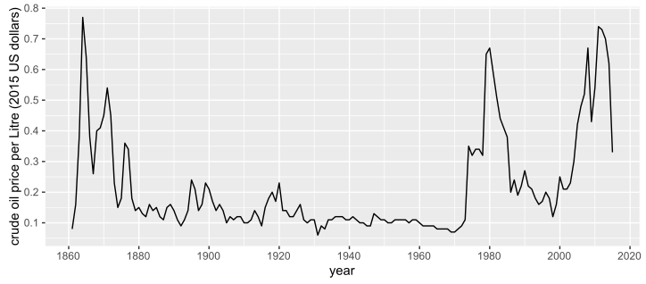
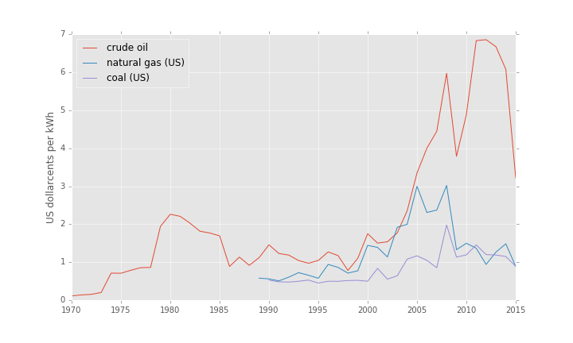
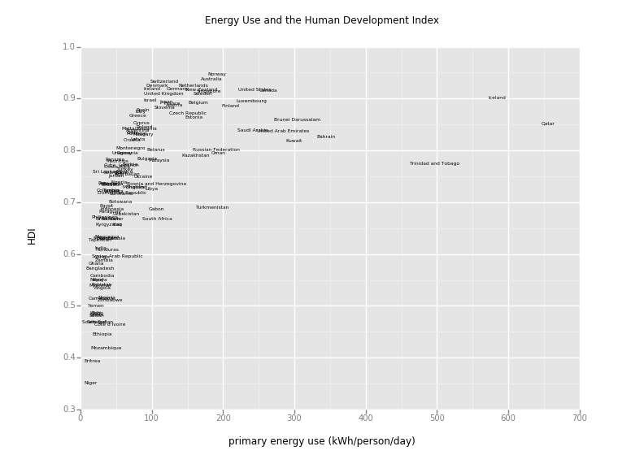

# energydata

Energy statistics, analysis code and figures used for http://sustainsubstance.org

This repository contains graphs and data files created from various publicly available data sources on energy use, population and human development. The scripts used to generate the graphs and data files are also included.

Analysis was mostly done in [iPython notebooks](https://ipython.org/notebook.html), which can be run using:
`ipython3 notebook`   
Exported .py-versions of the notebooks are also included.

Plots were made using either [matplotlib with the ggplot-style](http://matplotlib.org/users/style_sheets.html), or with [ggplot for Python](http://yhat.github.io/ggplot/). As ggplot for Python doesn't yet support all features, some figures were made in R with [ggplot2](http://ggplot2.org/).

### Graphs:

 - Oil price (inflation-corrected, in 2015 US dollars per litre) over time:
   
   
 - Primary energy prices (not inflation-corrected, in US dollarcents per kWh) for crude oil, natural gas (in the US) and coal (in the US) between 1970 and 2015:
   

 - TPES (Total Primary Energy Supply) vs. HDI (Human Development Index) for 2014: 
   

